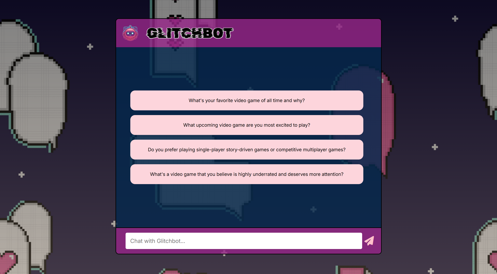
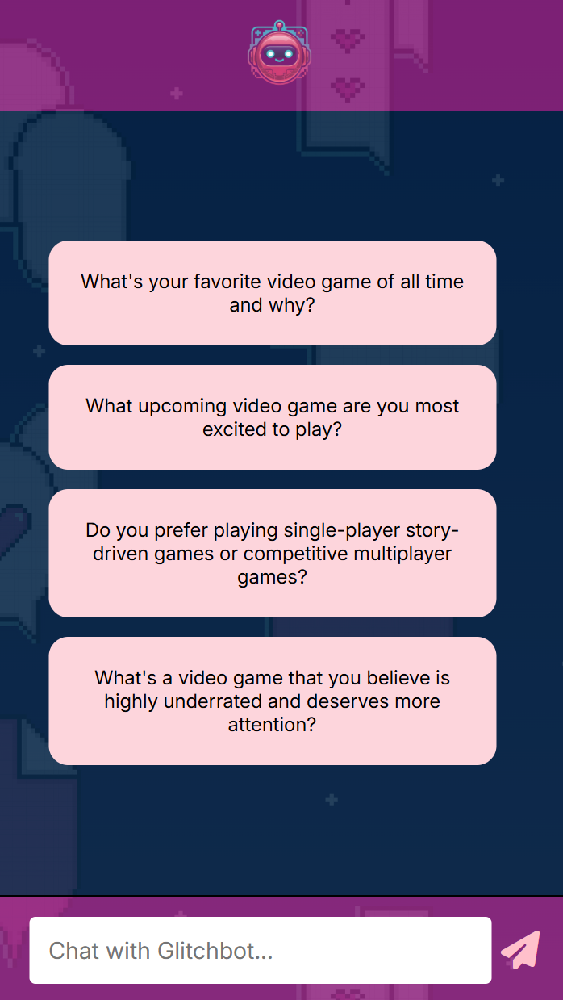

# 🎮 Glitchbot  

A **chatbot tailored for video games**, designed to assist, entertain, and interact like a real gaming companion and friend.  
Powered by **Gemini-Pro-Flash-2.5**, Glitchbot delivers fast, intelligent, and context-aware responses related to gaming worlds, characters, and mechanics.

---

## 📑 Table of Contents  
- [About](#-about)  
- [Features](#-features)  
- [Screenshots](#-screenshots)  
- [Tech Stack](#-tech-stack)  
- [Installation](#installation)  
---

## 📘 About  
**Glitchbot** is a browser-based chatbot built using **HTML**, **CSS**, and **JavaScript**, powered by **Gemini-Pro-Flash-2.5**.  
It’s designed to provide dynamic, game-related interactions — from answering gaming trivia to simulating NPC-like conversations or suggesting builds and strategies.

**🎯 Purpose:**  
To create an engaging, fast, and game-savvy chatbot that enhances user interaction and showcases my ability to integrate AI models into front-end web apps.

**💡 Inspiration:**  
Born from the idea of bringing *in-game assistance* to the browser, Glitchbot aims to blend the fun of gaming with the utility of conversational AI.

**🤝 More Than Just a Bot:**  
Glitchbot isn’t just an assistant — it’s also a **virtual friend** who listens, jokes, and chats casually with users. Whether you’re discussing strategies or just need a fun break, Glitchbot keeps the conversation lively and engaging.

---

## ✨ Features  
- ⚡ **Powered by Gemini-Pro-Flash-2.5** — Delivers fast, intelligent responses in real-time.  
- 💬 **Dynamic Conversation Bubbles** — Smooth animations and responsive chat layout.  
- 🌈 **Modern UI** — Minimal, responsive design inspired by gaming aesthetics.  
- 🤖 **Friendly AI Mode** — Chat casually with Glitchbot like a gaming buddy.  
- 💡 **Predefined Prompts** — Don’t have anything to ask? Try one of the suggested questions.  

---

## 📸 Screenshots  

| 💻 Desktop View | 📱 Mobile View |
|:----------------:|:--------------:|
|  |  |

---

## 🧰 Tech Stack  

**Frontend:**  
- HTML  
- CSS  
- JavaScript  

**AI Integration:**  
- Google Gemini API (Gemini-Pro-Flash-2.5)

**Tools Used:**  
- Visual Studio Code  
- Git & GitHub  

---

## Installation  

Run the project locally in a few easy steps:

```bash
# Clone the repository
git clone https://github.com/your-username/glitchbot.git

# Navigate into the project folder
cd glitchbot

# Install packages
npm i

# Open in your browser
npm run dev
